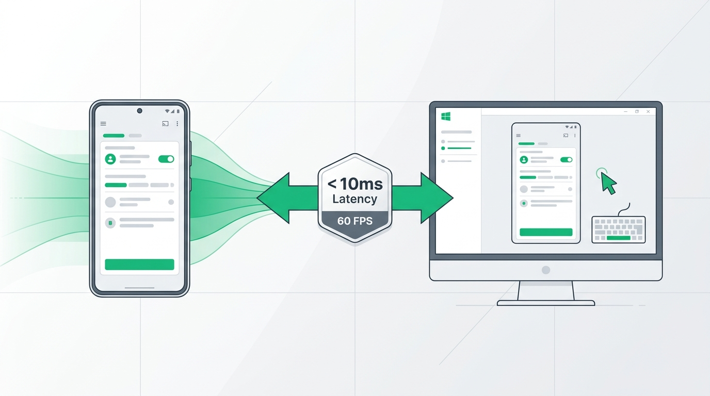
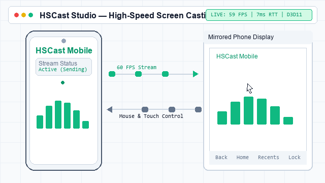

# ⚡ HSCast — High-Speed Screen Casting & Control

> Fast, smooth, and low-latency two-way screen casting between **Android** and **Windows** with full mouse and keyboard control.

---

## 🌟 What is HSCast?

**HSCast** lets you seamlessly share screens between your Android phone and Windows PC over a **USB cable** or your local **Wi-Fi**:

* 📱 ➔ 💻 **Phone to PC (Mirroring)**: View your phone's display on your PC with full mouse, touch gesture, and keyboard control (like *scrcpy*).
* 💻 ➔ 📱 **PC to Phone (Desktop)**: Stream your Windows PC monitor directly onto your phone screen.
* ⚡ **Ultra-Low Latency**: High frame rates (up to 60+ FPS) with instant hardware-accelerated streaming.

---

## 📸 Overview & Live Demo

### Pictorial Overview


### Live Demo (In Action)


---

## 📱 How to Run on Android

### Step 1: Install the Android App
* Open the `android/` folder in **Android Studio** and click **Run**, or build the APK using:
  ```bash
  cd android
  .\build-apk.bat
  ```
* Install the generated `.apk` onto your phone.

### Step 2: Enable Phone Settings
1. **USB Debugging** *(for USB cable connection)*:
   * Go to phone **Settings → Developer Options → Enable USB Debugging**.
2. **Remote Input Control** *(optional, to control phone with PC mouse & keyboard)*:
   * Go to phone **Settings → Accessibility → HSCast remote input → Enable**.

### Step 3: Start Casting
* Open the **HSCast** app on your phone.
* Select your mode:
  * **Cast Phone Screen** (to stream to PC).
  * **Receive PC Screen** (to view PC screen on phone).
* Tap **Start Casting** and accept the screen capture prompt.

---

## 💻 How to Run on Windows (Quick Start)

### Option 1: 1-Click Graphical Launcher (Easiest)
Simply double-click the launcher file in the project folder:
```cmd
Launch-HSCast.bat
```
This automatically sets up the environment and opens the **HSCast Studio** control window.

---

## 🖥️ How to Run Using Terminal in Windows

You can run HSCast directly from **PowerShell** or **Command Prompt (CMD)** inside the `windows` directory.

### Step 1: First-Time Setup & System Check
Open your terminal in the `windows` folder and run:
```powershell
cd windows
.\run.ps1 doctor
```
*This verifies your Python version, GPU acceleration, and ADB connection.*

---

### Step 2: Launch via Terminal Commands

#### 1. Open the Graphical Studio (GUI)
```powershell
.\run.ps1
```
*(or `.\run.ps1 gui`)*

---

#### 2. Mirror Phone to PC (Phone ➔ PC)
* **Using USB Cable** *(recommended for lowest latency)*:
  ```bash
  python -m hscast mirror
  ```
  *(or `.\run.ps1 mirror`)*

* **Using Wi-Fi**:
  ```bash
  python -m hscast mirror --wifi <PHONE_IP_ADDRESS>
  ```
  *Example: `python -m hscast mirror --wifi 192.168.1.50`*

---

#### 3. Cast PC Desktop to Phone (PC ➔ Phone)
* **Using USB Cable**:
  ```bash
  python -m hscast desktop
  ```
  *(or `.\run.ps1 desktop`)*

* **Using Wi-Fi**:
  ```bash
  python -m hscast desktop --wifi
  ```
  *(The terminal will display the PC's IP address to enter into your phone app).*

---

## ⌨️ Helpful Keyboard Shortcuts (PC Mirror Window)

| Shortcut | Action |
|---|---|
| `Ctrl + F` | Toggle Fullscreen |
| `Ctrl + B` *(or Right-Click)* | Back button |
| `Ctrl + H` *(or Middle-Click)* | Home screen |
| `Ctrl + S` | Recents / App Switcher |
| `Ctrl + N` | Notification Shade |
| `Ctrl + P` | Lock Screen |
| `Ctrl + W` | Wake Screen |
| `Ctrl + Q` | Quit / Close window |
| `Left-Click & Drag` | Touch swipe / gesture |
| `Mouse Wheel` | Scroll up / down |

---

## 📋 System Requirements

* **Windows**: Windows 10 or 11 (64-bit), Python 3.12 or newer.
* **Android**: Android 8.0 or higher.
* **Connection**: USB cable with ADB enabled, or both devices on the same Wi-Fi network.
